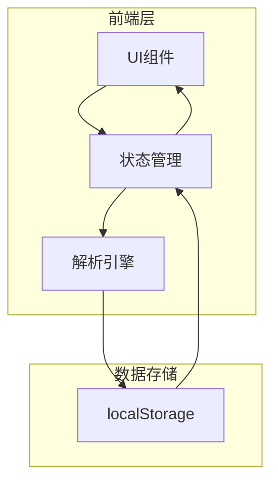

# 拼豆仓库小程序 - 技术架构文档

## 1. 架构设计

本项目采用纯前端架构，使用 React + Vite 构建，数据存储在浏览器 localStorage 中，无需后端服务。



## 2. 技术说明

- **前端框架**: React@18 + Vite
- **样式方案**: Tailwind CSS@3 + 自定义CSS（手绘风格效果）
- **状态管理**: React Hooks (useState, useEffect, useCallback)
- **数据持久化**: localStorage
- **字体服务**: Google Fonts (Patrick Hand, Quicksand)
- **图标方案**: 自定义SVG简笔画图标

## 3. 路由定义

本项目为单页应用（SPA），无需路由：

| 路由 | 用途 |
|------|------|
| / | 首页，显示仓库总览和所有功能 |

## 4. 项目结构

```
/workspace/
├── index.html              # 入口HTML
├── src/
│   ├── App.jsx            # 应用主组件
│   ├── main.jsx           # React入口
│   ├── index.css          # 全局样式 + Tailwind
│   ├── components/        # 组件目录
│   │   ├── BeadCard.jsx   # 豆子卡片组件
│   │   ├── AddBeadModal.jsx # 添加豆子弹窗
│   │   ├── SearchBar.jsx  # 搜索栏组件
│   │   └── Header.jsx     # 顶部标题组件
│   ├── utils/
│   │   ├── parser.js      # 解析豆子信息的工具函数
│   │   └── storage.js     # localStorage操作工具
│   └── assets/
│       └── icons/         # SVG图标
├── package.json
├── vite.config.js
└── tailwind.config.js
```

## 5. 数据模型

### 5.1 数据模型定义

```typescript
// 豆子数据
interface BeadData {
  id: string;          // 唯一标识符
  colorCode: string;   // 色号，如 "P01", "01", "A01"
  colorName?: string;  // 颜色名称，如 "红色", "玫瑰红"
  colorHex?: string;   // 颜色色值，如 "#FF0000"
  quantity: number;    // 数量（颗）
  createdAt: string;   // ISO 8601 时间戳
  updatedAt: string;   // ISO 8601 时间戳
}

// 应用状态
interface AppState {
  beads: BeadData[];      // 所有豆子数据
  searchTerm: string;     // 搜索关键词
  isModalOpen: boolean;   // 弹窗开关状态
}
```

### 5.2 数据存储 Key

- `beads_inventory`: 存储豆子库存数据数组

## 6. 核心功能实现

### 6.1 智能解析算法

支持识别以下格式：
1. `P01-红色-100颗` → {colorCode: "P01", colorName: "红色", quantity: 100}
2. `P01 红色 100` → {colorCode: "P01", colorName: "红色", quantity: 100}
3. `P01 100` → {colorCode: "P01", quantity: 100}
4. `01 红色 50` → {colorCode: "01", colorName: "红色", quantity: 50}
5. 多行文本批量解析

解析逻辑：
- 按行分割文本
- 使用正则表达式提取色号（字母+数字组合）、颜色名称（中文字符）、数量（数字）
- 支持多种分隔符（空格、制表符、横线、逗号）

### 6.2 颜色映射

内置常见拼豆色号到十六进制颜色的映射表：
- 主流拼豆品牌色号（Perler, Artkal, 普利等）
- 用户可通过PRD或后续版本自定义颜色

### 6.3 数据同步

- 初始加载时从 localStorage 读取数据
- 数据变更时自动同步到 localStorage
- 支持合并相同色号的库存（数量相加）

## 7. UI组件设计

### 7.1 BeadCard 组件
- Props: `bead` (BeadData对象), `onUpdate` (更新回调)
- 显示：颜色块、色号、颜色名称、数量、手绘边框效果
- 交互：点击可编辑数量、删除

### 7.2 AddBeadModal 组件
- Props: `isOpen`, `onClose`, `onAdd`
- 功能：文本粘贴区、实时解析预览、确认/取消操作

### 7.3 SearchBar 组件
- Props: `value`, `onChange`
- 功能：实时搜索过滤，支持按色号和颜色名称搜索

### 7.4 Header 组件
- 显示：标题、简笔画装饰图标、快速录入按钮

## 8. 性能优化

- 使用 React.memo 优化卡片组件渲染
- 搜索使用防抖（debounce）减少渲染次数
- 大量数据时考虑虚拟滚动（后续扩展）
- localStorage 操作异步化，避免阻塞UI

## 9. 浏览器兼容性

- 支持现代浏览器（Chrome, Firefox, Safari, Edge）
- 最低版本：Chrome 80+, Firefox 75+, Safari 13+, Edge 80+
- 需要 localStorage API 支持