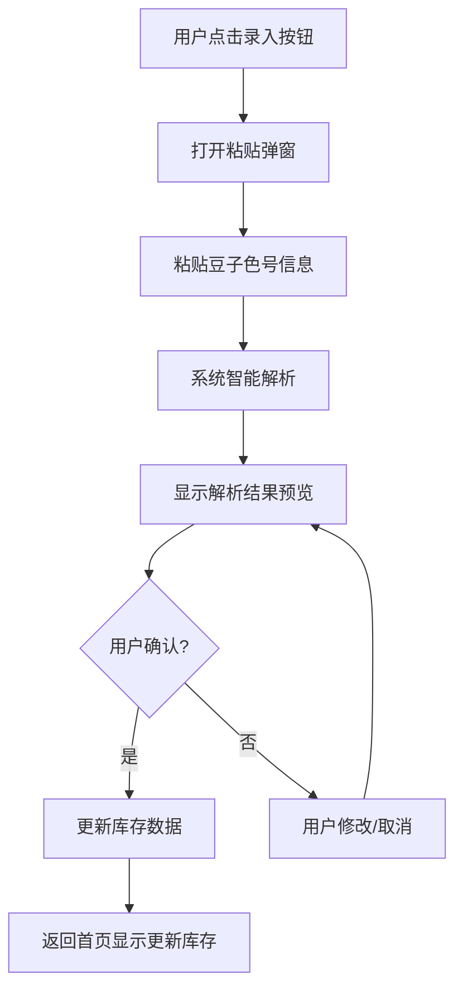
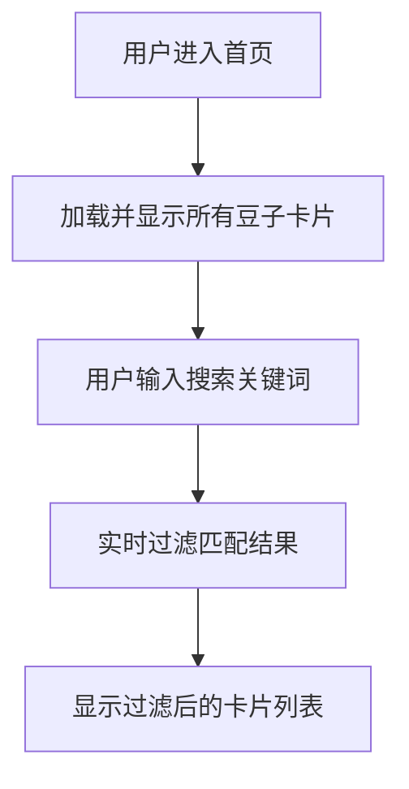

# 拼豆仓库小程序 - 产品需求文档

## 1. 产品概述

拼豆仓库小程序是一个面向拼豆爱好者的库存管理工具，帮助用户轻松管理拼豆库存。用户只需粘贴豆子色号信息，系统即可自动识别并记录每盒豆子的色号和数量，以可爱简笔画风格直观展示库存状态，让拼豆创作更加便捷有序。

**核心价值**：
- 解决拼豆爱好者库存管理混乱的问题
- 快速录入，粘贴即识别，无需手动逐个输入
- 可视化展示，一目了然看到所有色号的库存情况

## 2. 核心功能

### 2.1 目标用户
- 拼豆手工艺爱好者
- 拼豆作品创作者
- 拼豆材料经销商

### 2.2 功能模块

#### 首页（仓库总览）
1. **库存总览区域**：显示所有豆子色号的卡片列表
2. **快速录入入口**：一键打开粘贴识别弹窗
3. **搜索筛选**：按色号搜索豆子

#### 粘贴识别弹窗
1. **粘贴区域**：用户粘贴豆子色号信息
2. **智能解析**：自动识别色号和数量
3. **预览确认**：显示识别结果供用户确认添加

### 2.3 页面详情

| 页面名称 | 模块名称 | 功能描述 |
|---------|---------|---------|
| 首页（仓库总览） | 库存总览区域 | 以卡片形式展示所有豆子色号，每个卡片包含色号、颜色块、数量，卡片采用可爱简笔画风格，带有手绘边框 |
| 首页（仓库总览） | 快速录入按钮 | 悬浮按钮或顶部按钮，点击打开粘贴识别弹窗 |
| 首页（仓库总览） | 搜索栏 | 支持按色号搜索，实时过滤显示匹配的豆子 |
| 粘贴识别弹窗 | 粘贴文本区 | 大文本框支持粘贴豆子色号信息，支持多行粘贴 |
| 粘贴识别弹窗 | 智能解析引擎 | 自动识别格式如"P01-红色-100颗"、"P01 红色 100"、"P01 100"等常见格式 |
| 粘贴识别弹窗 | 解析结果预览 | 表格显示识别出的色号、颜色、数量，可编辑修改 |
| 粘贴识别弹窗 | 确认添加按钮 | 确认后更新库存数据，支持合并相同色号数量 |

## 3. 核心流程

### 主流程：粘贴录入豆子
用户点击快速录入按钮 → 打开粘贴识别弹窗 → 粘贴豆子色号信息 → 系统智能解析 → 用户预览确认 → 更新库存 → 返回首页查看更新后的库存



### 次要流程：查看和搜索库存
用户进入首页 → 查看所有豆子卡片 → 可输入搜索关键词 → 实时过滤显示匹配结果



## 4. 用户界面设计

### 4.1 设计风格

**整体风格**：可爱简笔画风格，手绘感，温馨活泼

**配色方案**：
- 主色调：柔和的粉色系 (#FFE5EC, #FFB6C1)
- 辅助色：清新蓝绿色 (#E0F4F4, #87CEEB)、暖黄色 (#FFF9E6, #FFE4B5)
- 强调色：珊瑚色 (#FF6B6B)、薄荷绿 (#98D8C8)
- 文字色：深灰色 (#4A4A4A)、浅灰色 (#888888)

**按钮样式**：
- 手绘风格圆角按钮，带有不规则边框效果
- 3D立体感，轻微阴影
- 悬停时有轻微弹跳动画

**字体**：
- 标题字体：手写风格字体（如 Patrick Hand, Comic Neue）
- 正文字体：圆润可爱的无衬线字体（如 Nunito, Quicksand）

**布局风格**：
- 卡片式布局，每个豆子色号为一张卡片
- 卡片带有手绘边框，铅笔线条效果
- 不规则网格排列，营造活泼感

**图标/装饰**：
- 简笔画小图标（豆子、盒子、爱心等）
- 手绘装饰元素（星星、云朵、小花朵）
- 悬浮的小动画元素

### 4.2 页面设计详情

| 页面名称 | 模块名称 | UI元素 |
|---------|---------|--------|
| 首页（仓库总览） | 顶部标题区 | 手写风格标题"我的拼豆仓库"，旁边有简笔画豆子图标装饰 |
| 首页（仓库总览） | 搜索栏 | 圆角手绘风格输入框，带有小放大镜图标 |
| 首页（仓库总览） | 豆子卡片网格 | 每张卡片包含：手绘边框、颜色块（显示实际颜色）、色号标签、数量显示、简笔画豆子小图标 |
| 首页（仓库总览） | 快速录入按钮 | 悬浮在右下角的圆形按钮，手绘风格，内含"+"号，带有轻微弹跳动画 |
| 粘贴识别弹窗 | 弹窗容器 | 模态弹窗，圆角设计，手绘边框，半透明背景遮罩 |
| 粘贴识别弹窗 | 标题区 | "粘贴豆子信息"，手写字体 |
| 粘贴识别弹窗 | 文本粘贴区 | 大型文本框，圆角，手绘边框，placeholder提示"粘贴豆子色号信息..." |
| 粘贴识别弹窗 | 解析结果表格 | 简洁表格显示：色号、颜色预览、数量，每行可编辑 |
| 粘贴识别弹窗 | 操作按钮 | "取消"和"确认添加"按钮，手绘风格，不同颜色区分 |

### 4.3 响应式设计

- 桌面优先设计，适配平板和移动端
- 大屏幕（>1200px）：4-5列卡片网格
- 中等屏幕（768-1200px）：3列卡片网格
- 小屏幕（<768px）：2列或单列卡片，弹窗全屏显示

### 4.4 动画效果

- 页面加载：卡片依次淡入，带有轻微缩放效果
- 卡片悬停：轻微上浮，阴影加深
- 按钮点击：弹跳效果
- 弹窗打开：从中心放大淡入
- 数量更新：数字跳动效果

## 5. 数据管理

### 5.1 本地存储
- 使用 localStorage 存储豆子库存数据
- 数据格式：JSON 数组
- 支持导出和导入功能（后续扩展）

### 5.2 数据结构
```typescript
interface BeadData {
  id: string;
  colorCode: string;  // 色号，如 "P01"
  colorName?: string; // 颜色名称，如 "红色"
  colorHex?: string;  // 颜色色值，如 "#FF0000"
  quantity: number;   // 数量
  createdAt: string;  // 创建时间
  updatedAt: string;  // 更新时间
}
```